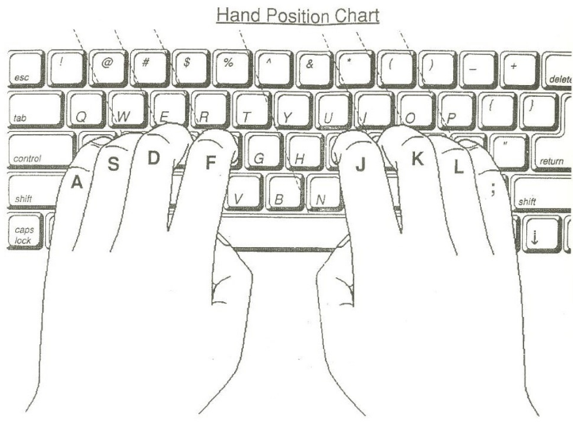
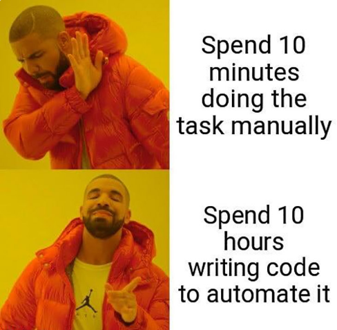
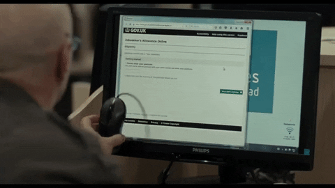
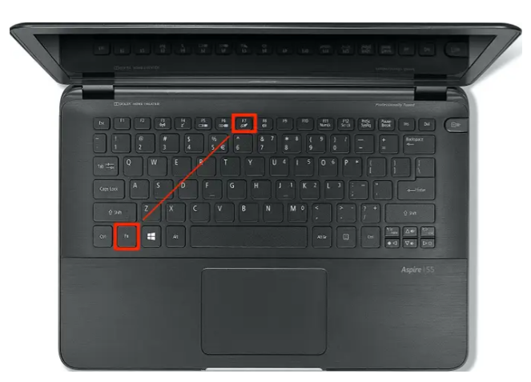
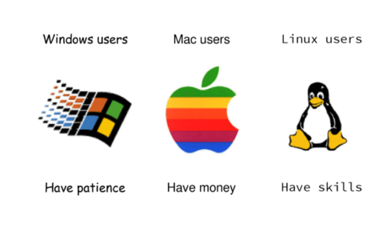
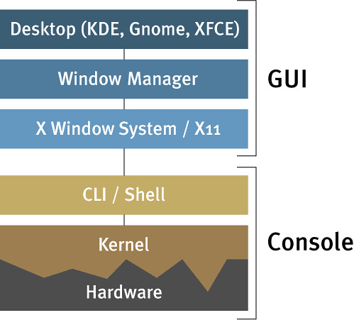

# How to become 10X Developer

---

# Your productivity is limited by your skills and your environments/tools.
* ~~Focus~~
* ~~Planing~~
* ~~Discipline~~
* Improve your skills
* Improve your environment

---

# Better all the time

newyorker.com/magazine/2014/11/10/better-time
> James Surowiecki

---

# Know Your Friends

* Automation
* Keyboard
* Computer Language
* Linux

---

# Know Your Enemies

* Mouse
* Windows/Mac

---

## Learn how to use your Keyboard

---

## Unfortunately, You only have two hands

---

## Start today!

* edclub.com
* monkeytype.com

---

# Automation

## You are not a human.

---

# Why mouse is an enemy

## Mouse is (unpredictable) against automation.

---

# How to stop using mouse

---

# Step 1
Throw your mouse away.

---

# Step 2
Disable touchpad

---

### Linux is user friendly. It's just very picky about who its friends are

---

# Windows and OSx are designed for average users. Linux is designed for developers.

---

# Why Linux is your friend

Because it lets you to have your own environment

---

# How to learn Linux
* By reading its [source code](https://github.com/torvalds/linux).
* If you are completely noob, install it in a VM and try to break it (NO MERCY)
* install it as your OAO OS and let it to break you. (NO MERCY)
* Have DUAL-BOOT if you need other OS also.

---

# The best linux distro myth
[Lets see](https://upload.wikimedia.org/wikipedia/commons/1/1b/Linux_Distribution_Timeline.svg)

---

# Wait

---

# Some definitions
* Windowing System (Xorg, Wayland)
* Desktop Environment (KDE, GNOME, XFCE)
* Window Manager
  * Tiling WM (i3, bspwm, awesome, dwm, xmonad)
  * Stacking/Floating WM (Kwin, Xfwm)
* Display Manager (LightDM, GDM, SDDM)

---

# Tools to learn:
* Shell script
* VIM
* TMUX
